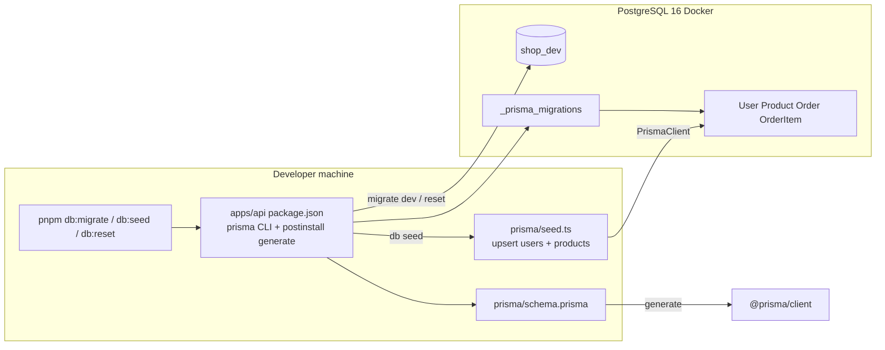

# Phase 2: Prisma Data Model - Research

**Researched:** 2026-05-18  
**Domain:** Prisma ORM 6 + PostgreSQL 16 schema, migrations, and idempotent seed in a pnpm/Turborepo NestJS monorepo  
**Confidence:** HIGH (schema/workflow locked in CONTEXT; version pin and Nest integration cross-verified against official Prisma docs)

## Summary

Phase 2 introduces Prisma as the single source of truth under `apps/api/prisma/`, with no Nest `PrismaModule` or REST surface yet. The codebase already has Docker Postgres 16 (`shop_dev`), `DATABASE_URL` in `apps/api/.env.example`, and root `pnpm db:up` / `db:down` from Phase 1 — Phase 2 adds schema, initial migration, seed, root `db:*` shortcuts, and verify scripts.

**Primary recommendation:** Pin **`prisma` and `@prisma/client` to `6.19.3`** (latest 6.x, matches `.planning/research/STACK.md` and project rules). Use the **Prisma 6** workflow (`url` in `schema.prisma`, `prisma-client-js`, seed via `package.json` → `"prisma"."seed"`, `import { PrismaClient } from '@prisma/client'`). **Do not adopt Prisma 7** in this phase: npm’s current default is 7.8.0, which requires `prisma.config.ts`, driver adapters (`@prisma/adapter-pg`), custom client `output`, ESM-oriented setup, and **explicit** `prisma db seed` after `migrate reset` — all of which conflict with Nest’s current **CommonJS** `apps/api` tsconfig and the locked `db:reset` expectation. [CITED: https://www.prisma.io/docs/orm/more/upgrade-guides/upgrading-versions/upgrading-to-prisma-7]

Phase 3 will consume the same schema path for `packages/types`; Phase 2 should document Decimal → `string` in public JSON (PITFALLS §6) without implementing DTOs.

<user_constraints>
## User Constraints (from CONTEXT.md)

### Locked Decisions

#### Prisma layout & tooling
- **D-01:** `schema.prisma` and migrations live under **`apps/api/prisma/`** (not `packages/database`).
- **D-02:** **Root `pnpm` shortcuts** — `db:migrate`, `db:seed`, `db:studio`, `db:reset`, `db:generate` delegate via **`pnpm --filter @kramnik/api exec prisma …`** so `apps/api/.env` loads.
- **D-03:** **`postinstall` in `apps/api`** runs `prisma generate`.
- **D-04:** **Single `schema.prisma`** file (no multi-file schema folder).
- **D-05:** Initial migration: **`prisma migrate dev --name init`** with full schema in one migration.
- **D-06:** Seed entrypoint: **`apps/api/prisma/seed.ts`** registered in `package.json` `prisma.seed`.
- **D-07:** Phase 3 preview: **`packages/types`** will depend on `@prisma/client` and generate from **`../../apps/api/prisma/schema.prisma`** (document path; implement in Phase 3).

#### Product model
- **D-08:** **`Category` enum** on `Product` — `HOME`, `GARBAGE`, `SCRAPS`, `GARDEN_GNOMES`.
- **D-09:** Core fields: `id`, `name`, `slug` (unique), `description`, `price`, `imageUrl`, `category`, `createdAt`, `updatedAt`. No `stock`, `sku`, `isActive`, or `deletedAt`.
- **D-10:** **`imageUrl`** uses external placeholder URLs in seed.
- **D-11:** All seeded products always visible (no publish/soft-delete flags).

#### Money & decimals
- **D-12:** Prices use **`Decimal @db.Decimal(10, 2)`** on `Product.price`, `OrderItem.unitPrice`, and `Order.total`.
- **D-13:** **USD only, implicit** — no `currency` column.
- **D-14:** **`OrderItem.unitPrice`** snapshots price; **`Order.total`** stored on order (checkout Phase 8).
- **D-15:** Phase 3 maps `Decimal` to **`string` in public JSON/DTOs** — note only in Phase 2.

#### User & roles
- **D-16:** **`Role` enum:** `CUSTOMER` | `ADMIN`.
- **D-17:** **`User`** includes **`passwordHash`** (bcrypt in seed; auth Phase 6).
- **D-18:** Minimal profile: `email` (unique), `passwordHash`, `role`, timestamps — no `name`.
- **D-19:** Seed **admin + one demo customer** with fixed dev credentials.

#### Order model
- **D-20:** **`OrderStatus` enum:** `PENDING`, `CONFIRMED`, `SHIPPED`, `CANCELLED`.
- **D-21:** **`Order.shippingAddress`** — single `String`.
- **D-22:** **`OrderItem`** includes **`productName` snapshot** plus `productId`, `quantity`, `unitPrice`.
- **D-23:** **No orders in seed**.
- **D-24:** Relations: planner picks `onDelete` — prefer **Restrict** on `OrderItem.productId` if admin must not delete ordered products.

#### Seed content
- **D-25:** Seed **~12 products**, all four categories.
- **D-26:** Themed catalog copy (home, garbage, scraps, garden gnomes).
- **D-27:** **Idempotent seed:** upsert users by **`email`**, products by **`slug`**.
- **D-28:** Dev credentials: `admin@kramnik.local` / `Admin123!`, `customer@kramnik.local` / `Customer123!` — README security warning.

#### Dev workflow & verification
- **D-29:** Extend root README: `db:up` → copy `.env` → `db:migrate` → `db:seed` → `dev`; optional `db:studio`; dev credentials.
- **D-30:** **`pnpm db:reset`** → `prisma migrate reset` (reapply migrations + seed on Prisma 6).
- **D-31:** **`bcrypt` or `bcryptjs`** in `apps/api` (seed now, auth Phase 6).
- **D-32:** **`scripts/verify-phase2.sh`** and **`scripts/verify-phase2.ps1`** — DB reachable, migrations applied, product count ≥ 12, admin user exists.

### Claude's Discretion
- `bcrypt` vs `bcryptjs` (prefer `bcryptjs` on Windows if native module friction).
- Exact product seed list within theme and category distribution.
- `onDelete` / `onUpdate` where not specified.
- Root script names if `db:migrate` vs `prisma:migrate` — keep consistent with Phase 1 `db:up` / `db:down`.
- Whether `verify-phase2` uses Prisma CLI JSON or SQL/count.

### Deferred Ideas (OUT OF SCOPE)
None — discussion stayed within phase scope.
</user_constraints>

<phase_requirements>
## Phase Requirements

| ID | Description | Research Support |
|----|-------------|------------------|
| DATA-01 | `schema.prisma` defines User, Product, Order, OrderItem (and enums/roles) | Schema pattern + enums + relations in **Architecture Patterns**; example schema in **Code Examples** |
| DATA-02 | Prisma migrations apply cleanly on a fresh database | `migrate dev --name init` on empty `shop_dev`; pitfalls for Windows/Docker; **Environment Availability** |
| DATA-03 | Seed script populates sample products and admin user | Idempotent upsert seed + `prisma.seed` in `package.json`; bcryptjs hashing; no orders in seed |
</phase_requirements>

## Architectural Responsibility Map

| Capability | Primary Tier | Secondary Tier | Rationale |
|------------|-------------|----------------|-----------|
| Schema definition (`schema.prisma`) | Database / Storage | API package (`apps/api`) hosts files | Schema is the persistence contract; lives beside Nest app that will own `PrismaService` in Phase 4 |
| Migrations (`prisma migrate`) | Database / Storage | Dev tooling (root `pnpm db:*`) | DDL runs against PostgreSQL; root scripts only orchestrate CLI with correct `.env` |
| Seed data | Database / Storage | API package (`seed.ts`) | Writes rows only; no HTTP or UI |
| Dev verification scripts | Dev tooling | — | Smoke checks before later phases; not runtime app logic |
| Decimal JSON shape for clients | API (Phase 3–4) | `packages/types` | Phase 2 stores `Decimal` in DB; serialization is API/DTO concern (D-15) |

## Standard Stack

### Core

| Library | Version | Purpose | Why Standard |
|---------|---------|---------|--------------|
| `prisma` | **6.19.3** (pin) | CLI: migrate, generate, studio, db seed | Matches STACK.md; avoids Prisma 7 breaking changes with Nest CJS [CITED: upgrade guide] |
| `@prisma/client` | **6.19.3** (pin) | Generated ORM client | Must match `prisma` version exactly |
| `bcryptjs` | **3.0.3** | Password hashing in seed | Pure JS; no native build on Windows (user discretion) |
| PostgreSQL | **16** (Docker) | Database | Already in `docker-compose.yml` |

### Supporting

| Library | Version | Purpose | When to Use |
|---------|---------|---------|-------------|
| `tsx` | **4.22.2** | Run `prisma/seed.ts` | Registered in `prisma.seed` script |
| `dotenv` | latest compatible | Optional explicit env load in seed | If `exec prisma` cwd/env edge cases on Windows |

### Alternatives Considered

| Instead of | Could Use | Tradeoff |
|------------|-----------|----------|
| Prisma 6.19.3 | Prisma 7.8.0 (npm latest) | v7 needs adapters, `prisma.config.ts`, ESM-friendly package setup, manual seed after reset; poor fit for Phase 2 scope |
| `bcryptjs` | `bcrypt` | Faster on Linux; native module compile pain on Windows |
| `packages/database` | `apps/api/prisma/` | User locked api-local schema (D-01) |

**Installation (apps/api):**

```bash
pnpm --filter @kramnik/api add @prisma/client@6.19.3 bcryptjs
pnpm --filter @kramnik/api add -D prisma@6.19.3 tsx
```

**Root package.json scripts (delegate to api workspace):**

```json
{
  "db:migrate": "pnpm --filter @kramnik/api exec prisma migrate dev",
  "db:seed": "pnpm --filter @kramnik/api exec prisma db seed",
  "db:studio": "pnpm --filter @kramnik/api exec prisma studio",
  "db:reset": "pnpm --filter @kramnik/api exec prisma migrate reset",
  "db:generate": "pnpm --filter @kramnik/api exec prisma generate"
}
```

**Version note:** `npm view prisma version` returned **7.8.0** at research time; project stack explicitly targets **Prisma 6** — planner must pin `6.19.3`, not `latest`. [VERIFIED: npm registry for version query; pin rationale from official v7 upgrade doc]

## Package Legitimacy Audit

> slopcheck and pip were unavailable in the research environment. All packages below are **`[ASSUMED]`** for planner gating per protocol.

| Package | Registry | Age | Downloads | Source Repo | slopcheck | Disposition |
|---------|----------|-----|-----------|-------------|-----------|-------------|
| `prisma@6.19.3` | npm | Mature | Very high | github.com/prisma/prisma | unavailable | Approved with pin — official ORM |
| `@prisma/client@6.19.3` | npm | Mature | Very high | github.com/prisma/prisma | unavailable | Approved with pin |
| `bcryptjs@3.0.3` | npm | Mature | Very high | github.com/dcodeIO/bcrypt.js | unavailable | Approved |
| `tsx@4.22.2` | npm | Mature | High | github.com/privatenumber/tsx | unavailable | Approved |

**postinstall check:** `npm view prisma@6.19.3 scripts.postinstall` and `bcryptjs` / `tsx` returned empty — no suspicious postinstall scripts observed.

**Packages removed due to slopcheck [SLOP] verdict:** none (slopcheck not run)  
**Packages flagged as suspicious [SUS]:** none

## Project Constraints (from .cursor/rules/)

From `.cursor/rules` (GSD project rules):

- **Fixed stack:** Prisma + PostgreSQL; no TypeORM/manual entities.
- **Types pipeline:** `schema.prisma` → client → `packages/types` DTOs → API → UI (Phase 3+).
- **GSD workflow:** Phase work via `/gsd-execute-phase` or `/gsd-quick`; avoid drive-by edits outside scope.
- **Phase 2 boundary:** Schema, migrate, seed, docs, verify scripts only — no Nest modules, REST, or `packages/types` implementation.

## Architecture Patterns

### System Architecture Diagram



### Recommended Project Structure

```
apps/api/
├── prisma/
│   ├── schema.prisma      # D-01, D-04 — single file
│   ├── seed.ts            # D-06
│   └── migrations/
│       └── YYYYMMDDHHMMSS_init/
│           └── migration.sql
├── .env.example           # DATABASE_URL (exists)
├── .env                   # gitignored — required for migrate/seed
└── package.json           # prisma seed, postinstall, dependencies
```

### Pattern 1: Prisma 6 init in Nest monorepo package

**What:** Colocate schema with the API app that owns `DATABASE_URL`; generate client into `node_modules/@prisma/client` via default `prisma-client-js` generator.

**When to use:** Phase 2–9; Phase 3 reads same schema path from `packages/types`.

**Example `schema.prisma` skeleton:**

```prisma
// Source: https://www.prisma.io/docs/orm/prisma-migrate/getting-started
generator client {
  provider = "prisma-client-js"
}

datasource db {
  provider = "postgresql"
  url      = env("DATABASE_URL")
}

enum Role {
  CUSTOMER
  ADMIN
}

enum Category {
  HOME
  GARBAGE
  SCRAPS
  GARDEN_GNOMES
}

enum OrderStatus {
  PENDING
  CONFIRMED
  SHIPPED
  CANCELLED
}

model User {
  id           String   @id @default(cuid())
  email        String   @unique
  passwordHash String
  role         Role     @default(CUSTOMER)
  orders       Order[]
  createdAt    DateTime @default(now())
  updatedAt    DateTime @updatedAt
}

model Product {
  id          String      @id @default(cuid())
  name        String
  slug        String      @unique
  description String
  price       Decimal     @db.Decimal(10, 2)
  imageUrl    String
  category    Category
  orderItems  OrderItem[]
  createdAt   DateTime    @default(now())
  updatedAt   DateTime    @updatedAt
}

model Order {
  id              String      @id @default(cuid())
  userId          String
  user            User        @relation(fields: [userId], references: [id], onDelete: Restrict)
  status          OrderStatus @default(PENDING)
  shippingAddress String
  total           Decimal     @db.Decimal(10, 2)
  items           OrderItem[]
  createdAt       DateTime    @default(now())
  updatedAt       DateTime    @updatedAt

  @@index([userId])
}

model OrderItem {
  id          String  @id @default(cuid())
  orderId     String
  order       Order   @relation(fields: [orderId], references: [id], onDelete: Cascade)
  productId   String
  product     Product @relation(fields: [productId], references: [id], onDelete: Restrict)
  productName String
  quantity    Int
  unitPrice   Decimal @db.Decimal(10, 2)

  @@index([orderId])
  @@index([productId])
}
```

**Recommended referential actions (planner discretion resolved):**

| Relation | onDelete | Rationale |
|----------|----------|-----------|
| `Order` → `User` | `Restrict` | Cannot delete user with orders (default for required FK) [CITED: referential actions defaults] |
| `OrderItem` → `Order` | `Cascade` | Line items die with order |
| `OrderItem` → `Product` | `Restrict` | Prevents deleting products referenced on orders (D-24 learning goal) [CITED: https://www.prisma.io/docs/orm/prisma-schema/data-model/relations/referential-actions] |

### Pattern 2: Root-orchestrated CLI with workspace filter

**What:** Root `pnpm db:*` runs Prisma in `@kramnik/api` context so `DATABASE_URL` resolves from `apps/api/.env`.

**When to use:** All migrate/seed/studio/reset/generate from repo root (D-02).

```bash
# From repo root — loads apps/api as package root for Prisma
pnpm --filter @kramnik/api exec prisma migrate dev --name init
pnpm --filter @kramnik/api exec prisma db seed
```

**Pitfall:** Running `prisma` from repo root without filter may miss `apps/api/.env` or schema path.

### Pattern 3: Idempotent seed with upsert

**What:** `upsert` on unique fields (`email`, `slug`) so repeated `db:seed` is safe (D-27).

**When to use:** Every seed run; required for `migrate reset` + dev re-runs.

```typescript
// Source: https://www.prisma.io/docs/orm/prisma-migrate/workflows/seeding (pattern)
import { PrismaClient, Prisma, Role, Category } from '@prisma/client'
import bcrypt from 'bcryptjs'

const prisma = new PrismaClient()

async function main() {
  const adminHash = await bcrypt.hash('Admin123!', 10)
  await prisma.user.upsert({
    where: { email: 'admin@kramnik.local' },
    update: { passwordHash: adminHash, role: Role.ADMIN },
    create: {
      email: 'admin@kramnik.local',
      passwordHash: adminHash,
      role: Role.ADMIN,
    },
  })
  // products: upsert by slug, price: new Prisma.Decimal('12.99')
}

main()
  .catch((e) => {
    console.error(e)
    process.exit(1)
  })
  .finally(() => prisma.$disconnect())
```

**`apps/api/package.json` (Prisma 6 seed registration):**

```json
{
  "scripts": {
    "postinstall": "prisma generate"
  },
  "prisma": {
    "seed": "tsx prisma/seed.ts"
  }
}
```

[CITED: Prisma 6 uses `package.json` `prisma.seed`; v7 moves seed to `prisma.config.ts` — another reason to stay on v6]

### Pattern 4: Fresh-database proof (DATA-02)

**What:** On empty `shop_dev`, `pnpm db:migrate` (with `--name init` on first run) creates `_prisma_migrations` and all tables.

**Steps:**

1. `pnpm db:up`
2. Copy `apps/api/.env.example` → `apps/api/.env`
3. Optional clean slate: `docker compose exec -T postgres psql -U postgres -d shop_dev -c "DROP SCHEMA public CASCADE; CREATE SCHEMA public;"`
4. `pnpm --filter @kramnik/api exec prisma migrate dev --name init`
5. `pnpm db:seed`

[CITED: https://www.prisma.io/docs/orm/prisma-migrate/getting-started]

### Anti-Patterns to Avoid

- **Prisma 7 “latest” by mistake:** `pnpm add prisma` pulls v7; breaks Nest CJS and seed-on-reset expectations.
- **Hand-rolled migration SQL without `migrate dev`:** Drift between schema and `migrations/` folder.
- **Seeding orders in Phase 2:** Violates D-23; checkout phase owns order creation.
- **Plaintext passwords in DB:** Store `passwordHash` only (D-17).
- **Returning `Decimal` in JSON (Phase 4+):** Use string DTOs (PITFALLS §6) — document in README/types note for Phase 3.

## Don't Hand-Roll

| Problem | Don't Build | Use Instead | Why |
|---------|-------------|-------------|-----|
| Schema migrations | Manual SQL-only workflow | `prisma migrate dev` / `migrate deploy` | Migration history, drift detection, team sync |
| ORM/query layer | Raw `pg` repositories in Phase 2 | Prisma Client | Type-safe client from schema; Nest integration in Phase 4 |
| Password hashing | Custom salt/hash | `bcryptjs` | Standard cost factor; same lib pattern for Phase 6 auth |
| Idempotent dev data | DELETE-all + INSERT | `upsert` on unique keys | Safer for partial runs and reset |
| DB smoke checks in verify | Full test suite only | `verify-phase2` + optional vitest file checks | Fast gate matching Phase 1 pattern |

**Key insight:** Prisma already solves migration history, client generation, and seed orchestration — Phase 2 only configures paths and scripts correctly in the monorepo.

## Common Pitfalls

### Pitfall 1: Prisma 7 installed by accident

**What goes wrong:** `migrate reset` no longer auto-seeds; client requires adapter; imports break under Nest CJS.

**Why it happens:** `npm view prisma version` is 7.x; unpinned install.

**How to avoid:** Pin `prisma` and `@prisma/client` to `6.19.3` in `apps/api/package.json`.

**Warning signs:** `prisma.config.ts` required errors; seed not running after reset.

### Pitfall 2: CLI run from wrong directory / missing `.env`

**What goes wrong:** `P1012` / `DATABASE_URL` not found.

**Why it happens:** Prisma loads `.env` from project root (package with `prisma` dependency) — must be `apps/api`.

**How to avoid:** Always use `pnpm --filter @kramnik/api exec prisma …` (D-02).

### Pitfall 3: Decimal serialization in later phases

**What goes wrong:** API returns `Decimal` objects; frontend price math breaks.

**Why it happens:** `JSON.stringify` does not serialize Decimal.js like numbers.

**How to avoid:** Phase 3 DTOs use `price: string`; map with `.toString()` in API (D-15, PITFALLS §6). [CITED: https://www.prisma.io/docs/orm/prisma-client/special-fields-and-types#working-with-decimal]

**Phase 2 note only:** Seed may use `new Prisma.Decimal('19.99')` or string literals accepted by Prisma.

### Pitfall 4: Windows + native `bcrypt`

**What goes wrong:** Install fails or needs build tools.

**How to avoid:** Use `bcryptjs` (locked discretion favors this on Windows).

### Pitfall 5: Docker not running during verify

**What goes wrong:** `verify-phase2` fails on `pg_isready` though schema is correct.

**How to avoid:** Document precondition: `pnpm db:up`; chain `verify-postgres` like Phase 1.

### Pitfall 6: Shadow database / migrate dev on shared DB

**What goes wrong:** `migrate dev` fails creating shadow DB.

**Why it happens:** Restricted hosted Postgres; less common on local Docker.

**How to avoid:** Local Docker `shop_dev` is full-access; optional `shadowDatabaseUrl` only if needed (Prisma 6: env in schema datasource block).

## Code Examples

### Initial migration (developer command)

```bash
# Source: https://www.prisma.io/docs/orm/prisma-migrate/getting-started
pnpm db:up
pnpm --filter @kramnik/api exec prisma migrate dev --name init
```

### Decimal in seed

```typescript
// Source: https://www.prisma.io/docs/orm/prisma-client/special-fields-and-types#working-with-decimal
import { Prisma } from '@prisma/client'

await prisma.product.upsert({
  where: { slug: 'rusty-gnome-hammer' },
  update: {},
  create: {
    slug: 'rusty-gnome-hammer',
    name: 'Rusty Gnome Hammer',
    description: 'For garden gnomes who mean business.',
    price: new Prisma.Decimal('14.99'),
    imageUrl: 'https://placehold.co/400x300?text=Gnome+Hammer',
    category: Category.GARDEN_GNOMES,
  },
})
```

### verify-phase2 (SQL via Docker — matches Phase 1 postgres pattern)

```bash
# Pattern: scripts/verify-postgres.sh — extend for phase 2
docker compose exec -T postgres psql -U postgres -d shop_dev -tAc \
  "SELECT COUNT(*) FROM \"Product\" WHERE 1=1" | grep -E '^[0-9]+$'
docker compose exec -T postgres psql -U postgres -d shop_dev -tAc \
  "SELECT 1 FROM \"User\" WHERE email='admin@kramnik.local' LIMIT 1"
```

Alternative: `pnpm --filter @kramnik/api exec prisma db execute --stdin` with SQL (Prisma 6 supports `--schema` flag). [CITED: v7 removes `--schema` on db execute — another v7 avoidance reason]

### Phase 3 schema path (document only)

In Phase 3, `packages/types` can run generate against:

`../../apps/api/prisma/schema.prisma`

(D-07 — not implemented in Phase 2.)

## State of the Art

| Old Approach | Current Approach | When Changed | Impact |
|--------------|------------------|--------------|--------|
| `package.json` `prisma.seed` only | Prisma 7 `prisma.config.ts` `migrations.seed` | v7.0 | Stay on v6 for this project until Nest/tsconfig ESM migration planned |
| Auto-seed on `migrate reset` | v7: explicit `db seed` only | v7.0 | D-30 satisfied by Prisma 6 `migrate reset` behavior |
| `prisma-client-js` default in `node_modules` | v7: `prisma-client` + required `output` | v7.0 | Phase 2 keeps classic generator |
| Implicit env in CLI | v7: explicit `dotenv/config` | v7.0 | Prisma 6 loads `.env` from schema directory parent |

**Deprecated/outdated for this phase:**

- Prisma 7 upgrade path — defer until monorepo adopts ESM + driver adapters intentionally.
- `packages/database` workspace package — rejected in D-01.

## Assumptions Log

| # | Claim | Section | Risk if Wrong |
|---|-------|---------|---------------|
| A1 | Pin Prisma **6.19.3** (not npm latest 7.x) | Standard Stack | Rework scripts, seed, Nest integration if v7 installed |
| A2 | `bcryptjs` preferred over `bcrypt` on Windows | Standard Stack | Minor: switch package if user prefers native bcrypt |
| A3 | `String @id @default(cuid())` for all models | Code Examples | Low — planner may use `uuid()` if preferred |
| A4 | slopcheck unavailable — all packages `[ASSUMED]` | Package Audit | Human verify before install if desired |
| A5 | Prisma 6 `migrate reset` still runs seed automatically | Standard Stack / D-30 | If behavior changes in patch, chain `db:seed` after reset |

## Open Questions (RESOLVED)

1. **Primary keys: `cuid()` vs `uuid()` vs autoincrement `Int`?** — **RESOLVED:** `cuid()` on all models (`02-01-PLAN.md` Task 1).
2. **verify-phase2: SQL vs Prisma CLI?** — **RESOLVED:** Chain `verify-postgres` + Docker `psql` counts (`02-02-PLAN.md` Task 1); `prisma migrate status` in 02-01 for migration check.

## Environment Availability

| Dependency | Required By | Available | Version | Fallback |
|------------|------------|-----------|---------|----------|
| Node.js | Prisma CLI, tsx seed | ✓ | v22.22.0 | — |
| pnpm | Workspace scripts | ✓ | 9.15.9 (packageManager) | — |
| Docker | Postgres | ✓ (CLI) / ✗ (daemon paused) | 29.4.3 | Start Docker Desktop before migrate/verify |
| PostgreSQL `shop_dev` | migrate/seed | ✗ at research time | 16 (image) | `pnpm db:up` after unpause Docker |
| slopcheck / pip | Package audit | ✗ | — | Mark packages `[ASSUMED]`; planner checkpoint |

**Missing dependencies with no fallback:**

- Docker daemon running — blocks DATA-02/DATA-03 manual proof and `verify-phase2`.

**Missing dependencies with fallback:**

- slopcheck — manual review of official Prisma/bcryptjs packages.

## Validation Architecture

### Test Framework

| Property | Value |
|----------|-------|
| Framework | Vitest 3.2.4 (root) |
| Config file | `vitest.config.ts` |
| Quick run command | `pnpm test` |
| Full suite command | `pnpm test` |

### Phase Requirements → Test Map

| Req ID | Behavior | Test Type | Automated Command | File Exists? |
|--------|----------|-----------|-------------------|-------------|
| DATA-01 | Schema defines User, Product, Order, OrderItem + enums | unit (static) | `pnpm test tests/data/prisma-schema.test.ts` | ❌ Wave 0 |
| DATA-02 | Migrations apply on fresh DB | integration/smoke | `bash scripts/verify-phase2.sh` (after migrate) | ❌ Wave 0 |
| DATA-03 | Seed: ≥12 products, admin user | integration/smoke | `scripts/verify-phase2.sh` SQL counts | ❌ Wave 0 |
| FOUND-03 (regression) | Postgres reachable | smoke | `bash scripts/verify-postgres.sh` | ✅ |

### Sampling Rate

- **Per task commit:** `pnpm test` (fast static checks when added)
- **Per wave merge:** `scripts/verify-phase2.sh` or `.ps1` on Windows (requires `pnpm db:up`, migrate, seed)
- **Phase gate:** Fresh DB migrate + seed + verify scripts green before `/gsd-verify-work`

### Wave 0 Gaps

- [ ] `tests/data/prisma-schema.test.ts` — assert `schema.prisma` contains models/enums (DATA-01)
- [ ] `tests/data/readme-db-flow.test.ts` — README documents `db:migrate`, `db:seed`, dev credentials (D-29)
- [ ] `scripts/verify-phase2.sh` + `scripts/verify-phase2.ps1` (D-32)
- [ ] `tests/foundation/verify-phase2-scripts.test.ts` — static script content checks (mirror `postgres-scripts.test.ts`)
- [ ] Framework: no new install — use root Vitest

## Security Domain

### Applicable ASVS Categories (ASVS L1, schema/seed phase)

| ASVS Category | Applies | Standard Control |
|---------------|---------|------------------|
| V2 Authentication | Partial (seed only) | Store `passwordHash`, not plaintext (D-17) |
| V3 Session Management | No | Phase 6 |
| V4 Access Control | Partial (data model) | `Role` enum `ADMIN` \| `CUSTOMER` (D-16) |
| V5 Input Validation | No (no HTTP) | Phase 4+ DTOs |
| V6 Cryptography | Yes (seed) | `bcryptjs` with cost factor ≥10; dev passwords documented as non-production (D-28) |

### Known Threat Patterns

| Pattern | STRIDE | Standard Mitigation |
|---------|--------|---------------------|
| Tutorial credentials in README | Information disclosure | Label dev-only; never use in production (D-28, Phase 1 Postgres pattern) |
| Weak password storage | Tampering / disclosure | bcrypt hash in `passwordHash` column |
| SQL injection via Prisma | Tampering | Parameterized Prisma queries (Phase 4+); Phase 2 schema only |
| Product delete breaking orders | Integrity | `onDelete: Restrict` on `OrderItem.productId` |

## Sources

### Primary (HIGH confidence)

- [Prisma Migrate getting started](https://www.prisma.io/docs/orm/prisma-migrate/getting-started) — `migrate dev --name init`, migration folder layout
- [Prisma seeding](https://www.prisma.io/docs/orm/prisma-migrate/workflows/seeding) — seed.ts, v6 vs v7 seed behavior
- [Upgrade to Prisma 7](https://www.prisma.io/docs/orm/more/upgrade-guides/upgrading-versions/upgrading-to-prisma-7) — breaking changes motivating v6 pin
- [Referential actions](https://www.prisma.io/docs/orm/prisma-schema/data-model/relations/referential-actions) — Restrict/Cascade defaults
- [Working with Decimal](https://www.prisma.io/docs/orm/prisma-client/special-fields-and-types#working-with-decimal) — Decimal.js, Phase 3 string mapping
- [Prisma schema Decimal reference](https://www.prisma.io/docs/orm/reference/prisma-schema-reference#decimal) — `@db.Decimal(10, 2)`
- Project `02-CONTEXT.md`, `STACK.md`, `PITFALLS.md`, Phase 1 verify scripts

### Secondary (MEDIUM confidence)

- npm registry queries: `prisma@6.19.3`, `prisma` latest 7.8.0, `bcryptjs@3.0.3`, `tsx@4.22.2`
- [Prisma config reference (v6)](https://www.prisma.io/docs/orm/v6/reference/prisma-config-reference) — seed behavior comparison v6/v7

### Tertiary (LOW confidence)

- NestJS + Prisma monorepo blog patterns — not used for locked decisions; api-local schema matches project CONTEXT

## Metadata

**Confidence breakdown:**

- Standard stack: **HIGH** — CONTEXT locks layout; official docs confirm v6 vs v7 divergence
- Architecture: **HIGH** — entity model fully specified in CONTEXT; referential actions from Prisma docs
- Pitfalls: **HIGH** — Decimal and version pin documented officially; Windows bcrypt is ecosystem consensus

**Research date:** 2026-05-18  
**Valid until:** 2026-06-18 (30 days; pin Prisma 6.x unless upgrading intentionally)
